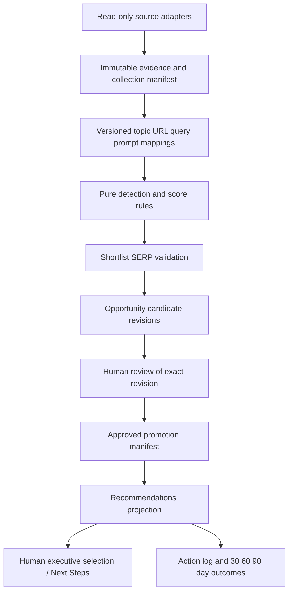

# RECOMMENDED_ARCHITECTURE

採 **C 的輕量 canonical evidence 核心 + B 的純函式 opportunity engine**：用版本化 JSON/JSONL artifacts、現有 Python 能力與受保護的 Sheets 投影。先建立可重播證據及決策邊界，暫不新增資料庫、queue、向量服務或 scheduler。

## 架構比較

| 面向 | A Report-centric | B Opportunity-engine-centric | C Canonical snapshot / evidence |
| --- | --- | --- | --- |
| 做法 | 在月報 builder 加 Ahrefs 邏輯 | 獨立 engine，直接讀 adapters | immutable evidence → entity maps → engine → review → projections |
| Complexity | 初期低、後期高 | 中 | 中高；檔案型 MVP 可控制 |
| Maintainability | 月份耦合、來源混算 | 規則可測；若即時 API 耦合仍不穩 | scope/version 明確，adapter 與 rules 分開 |
| Auditability | 重建容易覆寫歷史 | 若無原始 snapshot 仍不可重播 | input hashes、rules/profile versions、review revisions 可追溯 |
| Cost | 重跑可能重取所有資料 | 可 shortlist | cache/dedupe + budget，在 evidence 層共用 |
| MCP dependency | render 時或 build 時綁定 | engine 易誤綁 live API | collection 依賴 MCP；tests/engine/render 不依賴 |
| Future automation | 高風險直接寫表 | 可以但需要治理補丁 | run manifest、idempotency、promotion gate 先建好 |
| Luna maintainability | 快但跨月脆弱 | bounded pure rules 容易維護 | 分包明確；避免通用 DAG framework 才能維持可讀 |

選 C-lite 的原因是既有 append-only foundation 可以參考，資料不足與審批必須可追溯；不是因為 C 功能最多。現有 `snapshot_mvp` 僅接受限定 GA4/business metrics，**不能直接用來寫 Ahrefs records**。先獨立 evidence envelope，僅在 parity test 確認後抽取共用 hash/revision primitive。

## 邊界與單向流



Collection 可部分失敗；engine/render 不發網路 request。每次 run manifest 記 `run_id, env, scope_version, input_manifest_hash, entity_map_version, rules_version, score_profile_version, collection_status, created_at, output_hash, budget_usage`。相同輸入/版本產相同 candidate content hash；retrieved_at 不用來改寫既有 evidence。新的 fetch 是新 observation，修訂則保留 supersedes chain。

## Canonical target layout（尚未搬移）

```text
reporting/
  monthly_report/    # period-injected builder and projection only
  opportunity/      # entities, evidence validation, rules, scores, candidates, review, outcomes
  sources/          # Ahrefs/GSC/GA4/SF/SERP/Workduo/CrUX adapters
  snapshot_mvp.py   # retain existing formal actual contract behavior
contracts/          # immutable approved versions; *.proposal.json never production
apps_script/monthly_report/  # canonical templates, thin workbook reader
outputs/<period>/<run_id>/   # artifacts only; no executable production source
```

獨立維護：Evidence、Topic mappings、Candidate revisions、Human review events、Action executions、Outcome evaluations。不能用單一 status 欄承擔五種狀態。records 使用 stable ID，review events 綁 `candidate_revision + content_hash`；證據或推薦 action 改變即需重新批准。

## Environment isolation

新入口 `REPORT_ENV` 預設 preview：只能寫本機 run output，無 Sheets writer。uat 必須有獨立 allowlisted workbook ID 與 binding，拒絕 production / framework workbook ID；不能只換 tab 或 fake period `9999-01`。production 初期 hard-disabled，未完成 WP12 不能傳旗標繞過。

正式 activation 前需：環境設定 owner 核准、獨立 UAT readback、least privilege、review bridge test、diff manifest、production destination identity、回滾演練。就算日後允許 production，只有 bridge 能寫 approved payload；collector/engine 無該權限。現有 publisher 一般分頁覆寫不具原子性，新 projection 必須先 staging + readback manifest，再以單一 active_run 指標切換；Apps Script 未支援前禁止 production promotion。

failure fail-open 僅指舊報表可繼續顯示，**新 recommendation promotion 必須 fail-closed**。不能用舊 DESIGN 的 fail-open 去略過審批或來源矛盾。

## 漸進 migration

1. 凍結本文件 baseline；為月報 builder、schema、protected tabs 與 template 做 characterization fixtures，排除時間戳差異。
2. 建 `reporting/sources` / `opportunity` 新模組，先使用 proposal fixtures；不改既有 caller。
3. 另包遷移月報 pure helpers：先有 explicit period/input paths，再留舊路徑 thin wrapper；兩條路輸出 parity 才切換。
4. 單獨搬 template 到 `apps_script/monthly_report`；打包 / preview caller 同包修改、比較渲染，不同包不混。
5. UAT 接新 layer，舊 report schema 保持相容。production activation 是最後單獨包，保留上一個可讀 manifest 回滾。
6. 確認沒有 caller 使用旧 code 後，才在明確授權下移除 wrapper；歷史 outputs 保留。

本輪只交付設計/proposals，沒有 foundation implementation：production 路徑、scope approval 與隔離尚不足，不值得混入一小段看似可用的 adapter。
